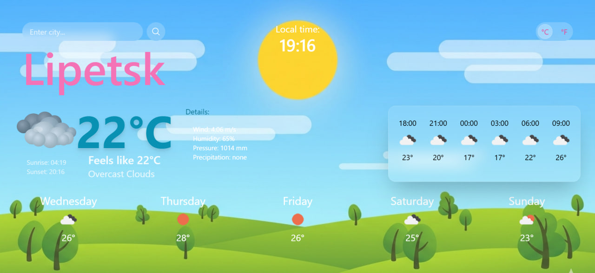
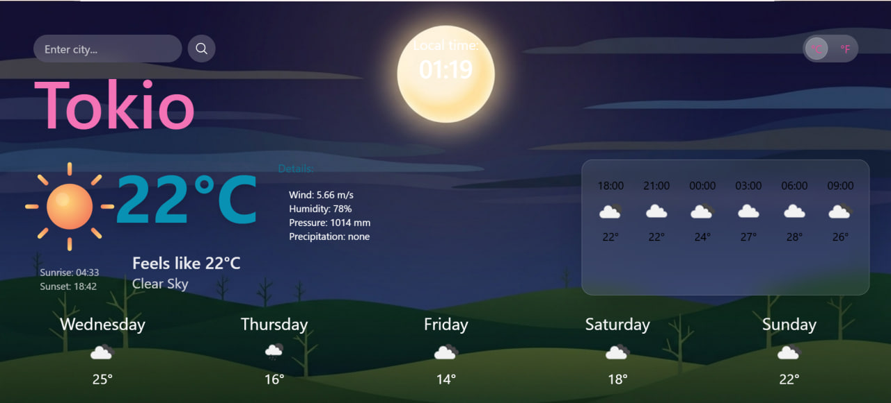
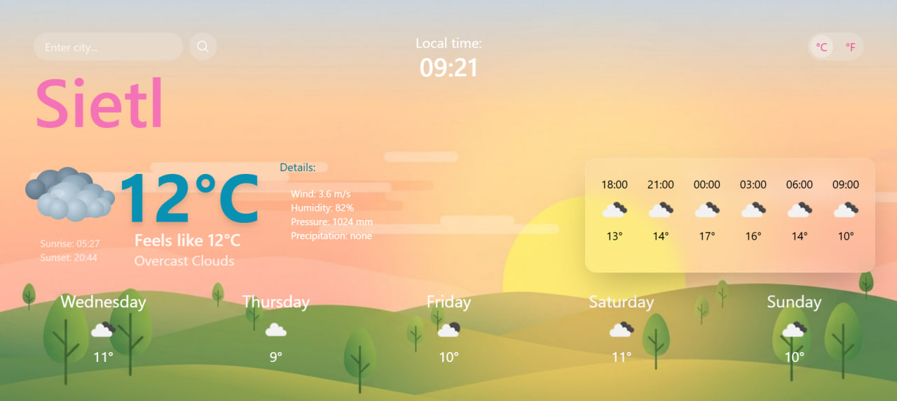
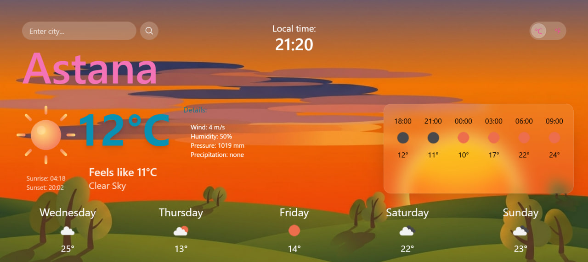

# 🌦️ Weather App

Интерактивное SPA-приложение для просмотра погоды, разработанное с использованием React, Vite и OpenWeather API.

Проект отображает текущую погоду, почасовой и многодневный прогноз, а также динамически изменяет интерфейс в зависимости от времени суток в выбранном городе.

> 🚧 Проект находится в активной разработке.

---

# ✨ Features

## 🔍 Поиск города
- Поиск городов на русском и английском языках
- Поддержка ввода через клавишу `Enter`
- Обработка несуществующих городов
- Работа с пользовательским вводом

---

## 🌤️ Weather Data
Приложение отображает:

- текущую погоду
- почасовой прогноз
- прогноз на несколько дней
- ощущаемую температуру
- влажность
- скорость ветра
- локальное время города

---

## 🎨 Dynamic Interface
- Динамические фоны:
  - 🌅 утро
  - ☀️ день
  - 🌇 вечер
  - 🌙 ночь
- Кастомные weather icons
- Conditional rendering интерфейса

---

## 🌡️ Temperature Conversion
- Переключение между:
  - Celsius (°C)
  - Fahrenheit (°F)
- Ручной пересчёт температуры через utility function

---

## ⚙️ Error & Loading States
- Отдельный loading screen
- Отдельный Error screen при ошибках
- Асинхронная обработка запросов через:
  - `async/await`
  - `try/catch`

---

# 🛠️ Tech Stack

| Technology | Description |
|---|---|
| React | UI library |
| Vite | Build tool |
| JavaScript (ES6+) | Application logic |
| Tailwind CSS | Styling |
| REST API | Работа с внешними данными |
| OpenWeather API | Получение погодных данных |
| Git & GitHub | Version control |

---

# 🧩 Reusable Components

В проекте используются переиспользуемые React-компоненты:

- `SearchBar`
- `CurrentWeather`
- `HourlyForecast`
- `DailyForecast`
- `UnitToggle`
- `Loader`
- `ErrorScreen`

---

# 🔧 Utility Functions

Для обработки данных и UI-логики используются отдельные utility functions:

```js
time()
weatherIcons()
temperature()
weatherTheme()
```

---

# 🧠 Technical Challenges

Во время разработки проекта были реализованы и изучены:

- Работа с REST API
- Асинхронные запросы
- Conditional rendering
- Работа с timezone calculations
- Динамическое изменение интерфейса
- Обработка различных состояний приложения
- Организация структуры React-приложения
- Ручной пересчёт температуры между °C и °F
- Работа с пользовательским вводом
- Логика отображения данных в зависимости от погодных условий

---

# 🚀 Planned Improvements

Планируемые улучшения проекта:

- 📱 Адаптивная верстка
- 🧭 Routing (React Router)
- 💾 LocalStorage
- 🔎 Debounced search input
- 🕘 История поиска городов
- 🔁 Retry button для error screen
- 🎞️ Дополнительные анимации
- 🎨 Улучшение UI/UX
- ⚡ Оптимизация производительности
- 🧹 Рефакторинг state management

---

# 📸 Screenshots

## 🔎 Start Screen


---

## 🌤️ Main Screen




---

## 🌙 Night Theme



---

## 🌅 Morning Theme



---

## 🌇 Evening Theme



---

# 🌐 Live Demo

🔗 GitHub Pages:  
https://your-username.github.io/weather-app/

---

# ⚙️ Installation

## 1. Clone repository

```bash
git clone https://github.com/your-username/weather-app.git
```

---

## 2. Navigate to project folder

```bash
cd weather-app
```

---

## 3. Install dependencies

```bash
npm install
```

---

## 4. Start development server

```bash
npm run dev
```

---

# 🔑 Environment Variables

Создай `.env` файл:

```env
VITE_API_KEY=your_api_key
```

API: OpenWeather

---

# 📚 About Project

Этот проект был создан в качестве pet project для практики frontend-разработки и работы с React ecosystem.

Основной фокус проекта:
- работа с API
- архитектура React-приложения
- организация компонентов
- UI-логика
- работа с асинхронными данными
- динамический интерфейс

---
